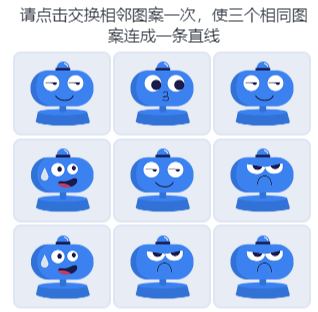
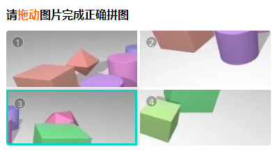
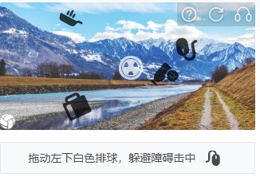

# 声明：本教程只能用于教学目的，如果用于非法目的与本人无关

## 本人24个实战视频教程，2k出售，有问题可以随时问，详情联系本人

## 试看视频 顶象空间推理.mkv 链接: https://pan.baidu.com/s/1ly-wmD5GMHpwTb2PpF8-ww?pwd=6666 提取码: 6666

## 视频详解地址：https://www.bilibili.com/video/BV1ABsHe9Eao/

## 教程素材网址：https://github.com/tomysky/crack_20_captcha

## 1.滑块验证码

> 方案1：ddddocr	https://github.com/sml2h3/ddddocr
>
> 方案2：opencv（canny做边缘检测，在做模板匹配）
>
> 方案3：yolov8 （m l模型）	https://github.com/ultralytics/ultralytics
>
> 1.某验的滑块验证码	简单
>
> 
>
> 2.某美的滑块验证码	简单
>
> ​	有混淆的图标，但是大小不一，目标检测，大小差不多的就是目标图标
>
> 
>
> 3.某盾的滑块验证码	简单
>
> ​	简单，直接目标识别，或者图像匹配
>
> 
>
> 4.某象的滑块验证码	简单
>
> ​	有混淆图标，但是匹配图标的验证更深，作为特征匹配，yolo可以实现
>
> 

## 2.文字点选验证码

> 方案：
>
> ​	yolo目标识别+分类网络（resnet50 101）+根据提供的文字顺序点击
>
> 1.某验的文字点选验证码	简单
>
> 
>
> 
>
> 2.某盾的语序点选验证码	适中
>
> ​	文字角度，颜色，抖动（特征明显）
>
> 
>
> 3.某美的文字点选	适中
>
> ​	字体只有角度旋转，颜色鲜艳，特征明显，可以生成样本自己训练
>
> 
>
> 4.某象文字点选验证码	适中
>
> ​	文字比较有个性，颜色不一，有重影，需要的样本数量会比较多
>
> 

## 3.图标点选验证码

> 方案：
>
> ​	yolo目标识别+分类网络+根据提供的图标顺序点击（基本都是矢量图，特征明显）
>
> 1.某验的图标点选验证码	简单
>
> ​	图标识别
>
> 
>
> 
>
> 2.某盾的图标点选验证码	简单
>
> ​	图标是矢量图，三个定选项，2个多余的，有旋转，有白色的容易混淆
>
> 
>
> 3.某美的图标点选	适中
>
> ​	颜色鲜艳，图标数量对应，特征明显
>
> 
>
> 4.某象图标点选验证码	适中
>
> ​	矢量图是白色，没有旋转，拉伸，特征明显
>
> 

## 4.语序点选验证码

> ​	方案：
>
> ​		目标识别+分类网络+固定句子（需要自己收集固定句子，做匹配）
>
> 1.某验的语序点选验证码	难
>
> ​	语序点选，句子不固定，句子样本量会比较大
>
> 
>
> 2.某盾的语序点选验证码	适中
>
> ​	文字角度，颜色，抖动（都是四字成语）
>
> 
>
> 3.某美的语序点选验证码	适中
>
> ​	字体颜色鲜艳，只有角度，特征明显，四字成语
>
> 
>
> 4.某象的语序点选验证码	适中
>
> ​	字体颜色明显，有重影和角度，需要大量样本，都是四字成语
>
> 
>
> ​	

## 5.空间推理验证码

> 方案：
>
> ​	一个物体多属性的问题，首先yolo找到目标，根据区域大小，确定图像的大小属性和位置；然后需要把形状，朝向，颜色做分类网络的one-hot编码，得出物体的属性后；接着padddleocr识别提示词；最后在根据语义词性分割得到具体要做什么。
>
> 1.某验的空间推理验证码	难
>
> 
>
> 2.某盾空间推理	难
>
> ​	有朝向，颜色，大小写，字母，数字，立方体
>
> 
>
> 3.某美的空间推理验证码	适中
>
> ​	没有重叠，颜色鲜艳，大小不一，特征明显，问题简单，逻辑推理简单
>
> 
>
> 4.某象的空间语义验证码	难
>
> ​	有二维图形，三维图形，大小写字母，语义简单（需要逻辑推理）
>
> ​	
>
> 

## 6.图像旋转

> 1.某象的旋转验证码	适中
>
> 方案：
>
> ​	需要把旋转圆的外圈干扰绿色去掉，放大到原来的大小，旋转角度通过计算重合边缘的Sobel梯度来寻找最佳旋转角度
>
> 

## 7.词序选词

> 方案：
>
> ​	有颜色，两个字组合，固定组合（需要数据量大），固定的四字语序。yolo目标检测，resnet50或者resnet101分类	
>
> 1.某盾语序选词	难
>
> ​	
>

## 8.消消乐

> 1.某验的消消乐验证码	适中
>
> ​	方案1：前提图像切割位置精确（每个图像分割出来都是一样的大小，位置相同），直接用md5计算图像的值来区分图像的类别。
>
> ​	方案2：怕图像切割位置不精确，直接用resnet18分类网络区分图像的类别。
>
> 

## 9.五子棋

> 1.某验的五子棋验证码	适中
>
> 棋盘的位置固定，区分各个棋子的颜色，判断四个棋子在一条线上，把另外的一个补上
>
> ​	方案1：前提图像切割位置精确（每个图像分割出来都是一样的大小，位置相同），直接用md5计算图像的值来区分颜色。
>
> ​	方案2：怕图像切割位置不精确，直接用resnet18分类网络区分颜色。
>
> 

## 10.九宫格

> 方案：
>
> ​	对每个图片进行图像分类，然后选择同一类的3个图。需要大量样本，直接就是分类resnet101网络
>
> 1.某验的九宫格验证码	高
>
> ​	
>
> 
>
> 2.yescaptcha	难
>
> 方案：
>
> ​	yolo （m，l，x）的目标检测可以检测8个类别中的6个，在单独训练剩下的人行道和楼梯基本就能完成任务
>
> 自行车（ok），摩托车（ok），公交车（ok），人行道，小轿车（ok），消防栓（ok），红绿灯（ok），楼梯（8个类别）
>
> 去除噪点，识别特定几个的物体，点击完了，在提交
>
> 
>
> 先拼接，识别要求的物体图像所在区域
>
> 

## 10.推理拼图

> 1.某盾的推理拼图验证码	适中
>
> 方案：
>
> ​	图片只有四张，用图像分类resnet50或者resnet18，总计8个分类，用位置作为分类。让模型记住图像位置。这样一旦有图像位置对不上，就能直接识别出来。
>
> 
>
> 2.某象的乱序拼图验证码	适中
>
> ​	方案1：遗传算法
>
> ​	方案2：计算图像边缘的直方图或者sobel算子
>
> 
>
> 3.某象的滑动还原验证码	适中
>
> 方案：
>
> ​	计算图像边缘的直方图或者sobel算子
>
> 

## 11.障碍躲避

> 1.某盾的障碍躲避验证码	适中
>
> 方案：
>
> ​	小球固定的，yolo识别图标的位置，resnet50分类图标，把小球和目标连起来，路径必须绕过识别的图标位置
>
> 

## 12.面积验证

> ​	1.某象的面积验证码	适中
>
> 方案：
>
> ​	用opencv找到线这个边界：先灰度，后二值化，放大这个线连成线，接着计算面积，最后得出结果
>
> 

## 13.差异点击验证

> 1.某象的差异点击验证码	适中
>
> 方案：
>
> ​	yolo定位目标，用resnet50网络 计算图像之间的余弦相似度
>
> 

## 14.语音验证

> 方案：
>
> ​	阿里的SenseVoice 1s内识别完内容	
>
> 1.某象的语音验证码	适中
>
> 播放四个数字，随便一个语音识别就可以
>
> 
>
> ​	2.售票网	适中
>
> ​	有噪音，需要去噪音在识别
>
> 

## 15.字体识别

> 1.某象的字体识别验证码	适中
>
> 方案：
>
> ​	不同风格的字体都跟其他7个不一样，要么空心，要么细，要么粗。用图像分类算法，总计：粗，细，空心三个分类
>
> 

## 16.刮刮卡

> 1.某象的刮刮卡验证码	难
>
> ​	在中间画一笔，这一笔中肯定能刮开目标的一部分，在用yolo制作一个目标检测模型，确定这个点。在点周围画一个圆。
>
> 

## 17.轨迹图

> 1. vaptcha的轨迹验证码	难
>
>    方案1：yolo关键点检测，再把关键点连接起来
>
>    方案2：maskrcnn或者pspnet网络做图像分割，在用skimage里现成的函数提取骨架。
>
>    
>    
>    
>    
>    

## 18.数字字母识别

> 1.不定长的数字字母识别
>
> cnn和lstm网络都可以

## 19.计算题

> 方案1：rcnn做训练，
>
> 方案2：yolo做目标检测，分类检测图标，转换为数学作加减
>
> 1.数字计算
>
> 
>
> 2.汉字计算
>
> 
## 20.本人联系方式

